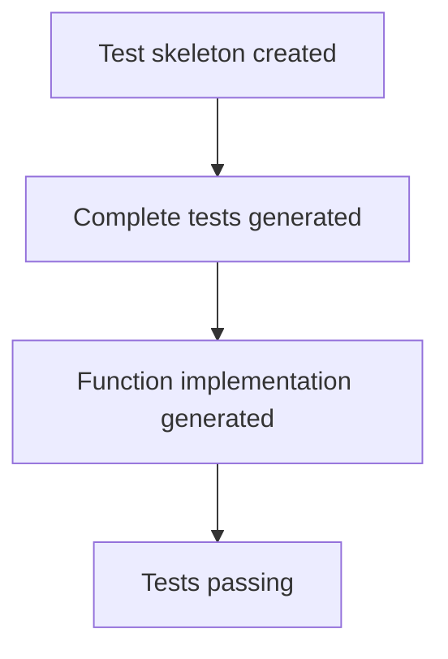

# LLM4TDD: TypeScript Example

This project demonstrates Test-Driven Development (TDD) using Large Language Models (LLMs). The workflow consists of three main steps:

1. **Generate Test Skeleton**: Create a basic structure for tests
2. **Generate Complete Tests**: Flesh out the test skeleton with actual test cases
3. **Generate Function Implementation**: Create a function that passes all the tests

## Workflow



## Usage

Run the complete TDD workflow:

```bash
npm run tdd
```

This will:
1. Generate a test skeleton for a random function
2. Generate a complete test file from the skeleton
3. Generate a function implementation that passes all the tests


## Utilities

The project includes several utility functions in the `utils` directory:

- `generateTestSkeleton.ts`: Creates a test skeleton using OpenAI
- `generateTestFromSkeleton.ts`: Generates complete tests from a skeleton
- `generateFunctionFromSpec.ts`: Creates a function implementation that passes tests
- `chat.ts`: Utility for interacting with OpenAI
- `readFileContent.ts`: Utility for reading file content
- `writeFileContent.ts`: Utility for writing file content
- `runTests.ts`: Utility for running tests

## Requirements

- Node.js
- npm
- OpenAI API key (set as OPENAI_API_KEY environment variable)
