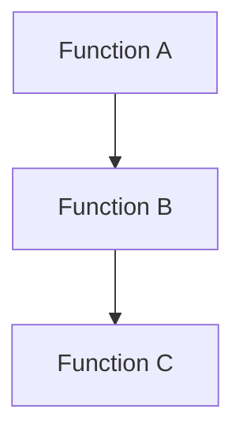

Ideally the `spec` file contains basic structure of tests in English and LLM generates the rest:

```ts
import { describe, it, expect } from 'vitest'

describe('functionName', () => {
	it('does the thing you want', () => {})
	it("doesn't do the thing you're worried about", () => {})
})
```

I want the tests to be generated

I want the function it is testing to be created

I want the function to recursively call an llm, adjusting the tested function until all of the tests are passed

I want to crawl and

I'm thinking it can then write a function to get the tests to pass.
Is it **agentic** to split this into multiple llm calls?



